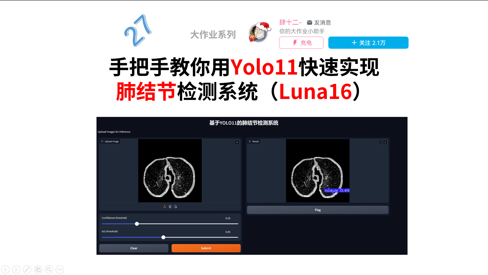

# LUNA16 YOLO Demo



This repository is a cleaned and lightweight version of a chest nodule detection project built around Ultralytics YOLO and the LUNA16 dataset. It keeps the custom training, validation, inference, and GUI entry points while leaving out large datasets, checkpoints, videos, and bundled upstream source code.

## What is included

- Training and validation scripts for a YOLO-based nodule detector
- A simple PySide6 GUI for image inference
- SAHI sliced inference for large or dense CT slices
- A LabelMe to YOLO segmentation conversion utility
- A few sample CT slices and prediction images for quick preview

## What is excluded

- Full LUNA16 dataset
- Trained `.pt` checkpoints
- Large demo videos
- Local IDE files, logs, and temporary outputs
- Hard-coded credentials from unrelated helper scripts

## Project structure

```text
app/                PySide6 demo application
assets/samples/     Sample CT images
assets/results/     Example outputs
assets/ui/          UI images used by the demo
configs/luna16.yaml Dataset config template
scripts/            Training, validation, and inference entry points
tools/              Dataset conversion helper
```

## Setup

```bash
pip install -r requirements.txt
```

Update [configs/luna16.yaml](configs/luna16.yaml) so that `path` points to your local dataset root.

## Usage

Train a model:

```bash
python scripts/train.py --model yolo11n.pt --device 0
```

Validate a checkpoint:

```bash
python scripts/validate.py --weights path/to/best.pt --device 0
```

Predict one image:

```bash
python scripts/predict_image.py --weights path/to/best.pt --source assets/samples/0004.png --show
```

Predict a webcam or video stream:

```bash
python scripts/predict_video.py --weights path/to/best.pt --source 0 --show
```

Run SAHI sliced inference:

```bash
python scripts/sahi_inference.py --weights path/to/best.pt --source assets/samples/0012.png
```

Launch the GUI demo:

```bash
python app/main_window.py
```

## Notes

- The original project mixed custom code with a full copy of the Ultralytics repository. This version uses `pip install ultralytics` instead, which makes the repo much smaller and easier to understand.
- The sample images in `assets/samples` are only for preview and smoke testing.
- If you want to recreate training results, prepare the dataset locally and place your own checkpoints outside the repository or under an ignored path.
