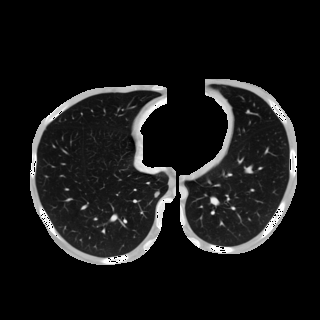
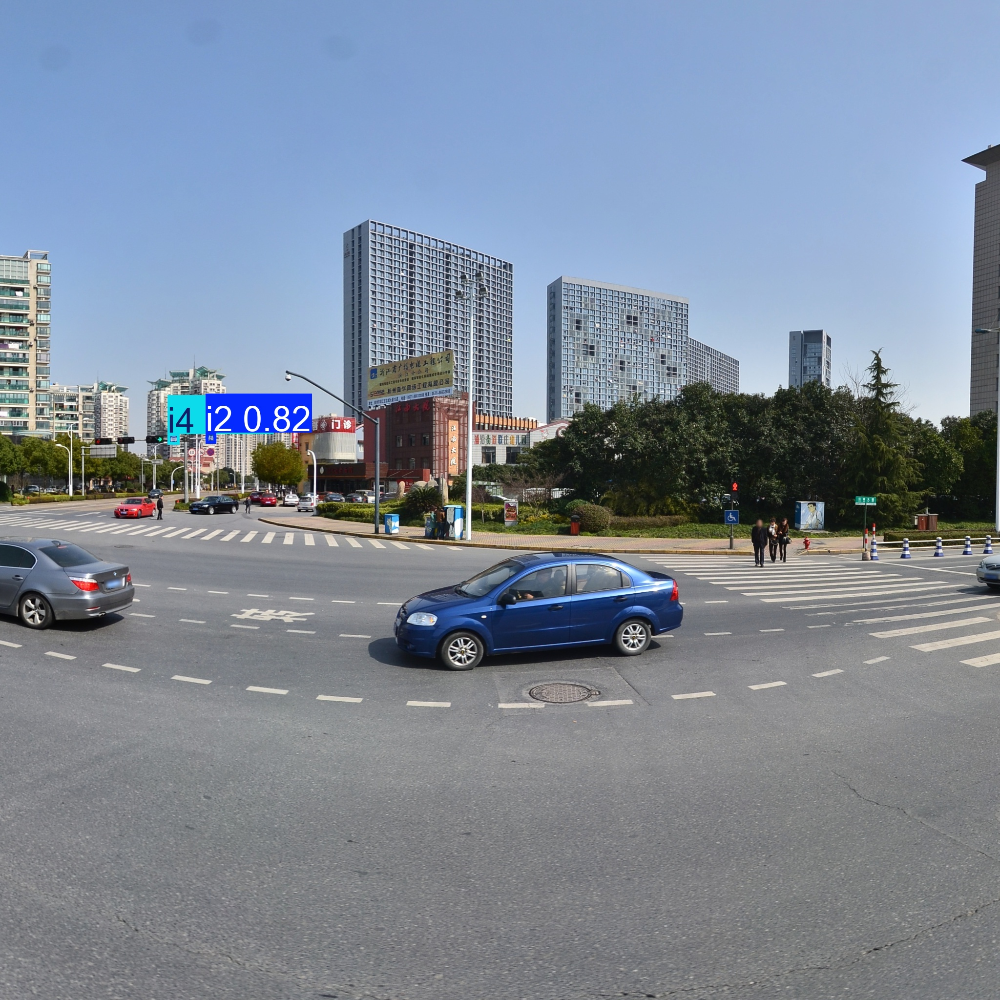

# LUNA16 YOLO Demo


## Overview

This repository is a cleaned and lightweight chest-nodule detection project built around Ultralytics YOLO and the LUNA16 dataset. It keeps training, validation, GUI inference, and SAHI sliced prediction in one compact demo repository.

## Preview


| Sample Slice | Detection Result |
| --- | --- |
|  |  |

## Highlights

- YOLO-based nodule detection workflow
- PySide6 desktop GUI for image inference
- SAHI sliced inference for dense or large CT slices
- LabelMe to YOLO segmentation conversion helper

## Project Structure

- `scripts/train.py`: training entry
- `scripts/validate.py`: validation entry
- `scripts/predict_image.py`: single-image inference
- `scripts/predict_video.py`: webcam or video inference
- `scripts/sahi_inference.py`: sliced inference with SAHI
- `app/main_window.py`: PySide6 GUI demo
- `configs/luna16.yaml`: dataset config template
- `tools/json2seg.py`: LabelMe-to-YOLO conversion helper
- `assets/`: UI images, sample CT slices, and example outputs

## Setup

```bash
pip install -r requirements.txt
```

Update `configs/luna16.yaml` so that `path` points to your local dataset root.

## Usage

Train:

```bash
python scripts/train.py --model yolo11n.pt --device 0
```

Validate:

```bash
python scripts/validate.py --weights path/to/best.pt --device 0
```

Run the GUI:

```bash
python app/main_window.py
```

## Notes

- Full datasets, checkpoints, and large demo videos are excluded.
- This repository is positioned as a lightweight demo / training shell for portfolio display and later reuse.
